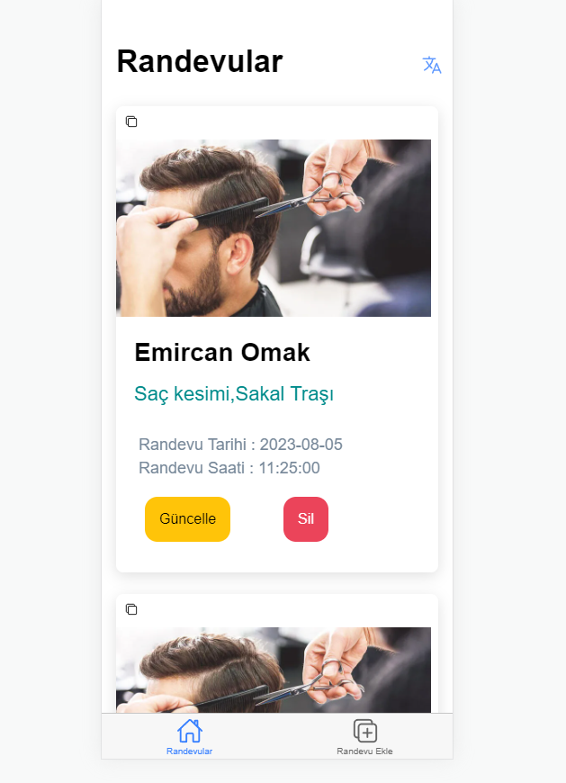
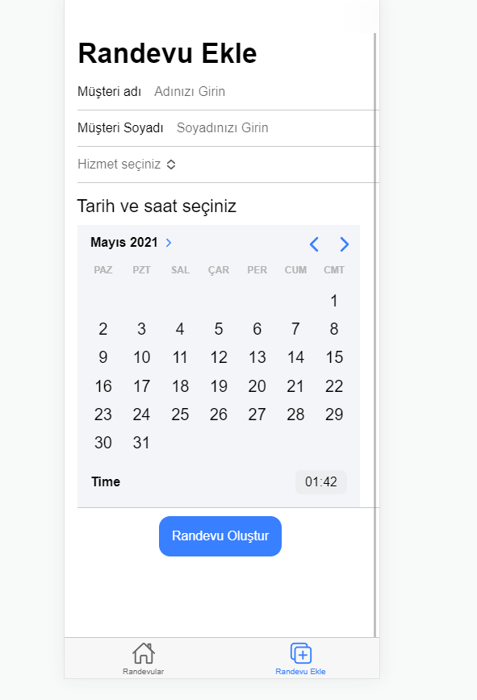
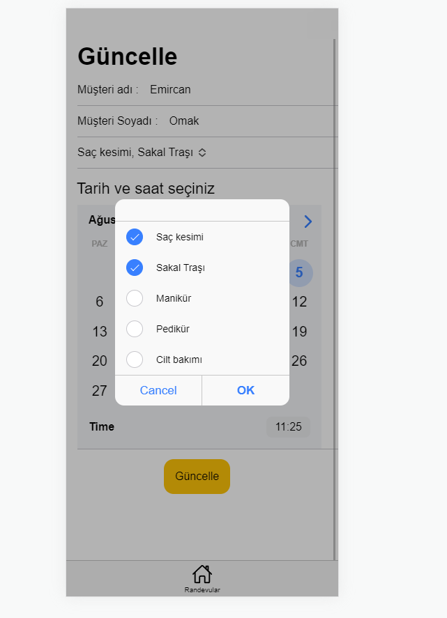

### Getting Started 

To clone the project;

    | git clone https://github.com/emircanomak/meetingsApp-Ionic
	// download project

To get the project up and running;

	npm install
	ionic serve

To get the json-server up

	src/api
	json-server --watch db.json

Open http://localhost:8100/ with your browser to see the result. 

You can access the home page via "/tabs/tab1" 
Page where you can add an appointment "/tabs/tab2"

### Used Technologies 

1. TypeScript - Ionic - Angular - Capacitor - Cordova - i18n(ngx-translate) - Http Loader , Firebase - ion-grid

### Images from the App 

#### Meetings Page
 

#### Add Meetings Page
 

#### Update
 

#### Multiple Language
 

#### Clipboard
 

